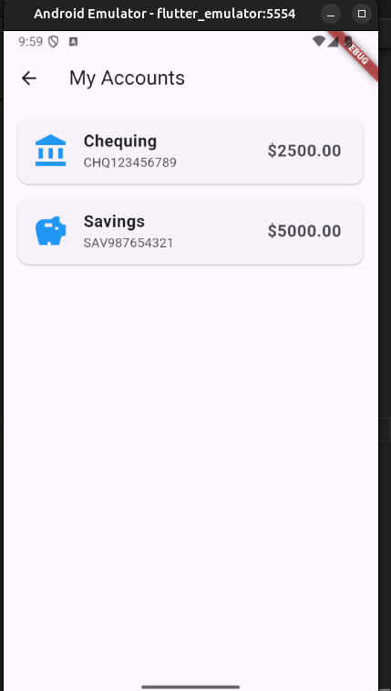
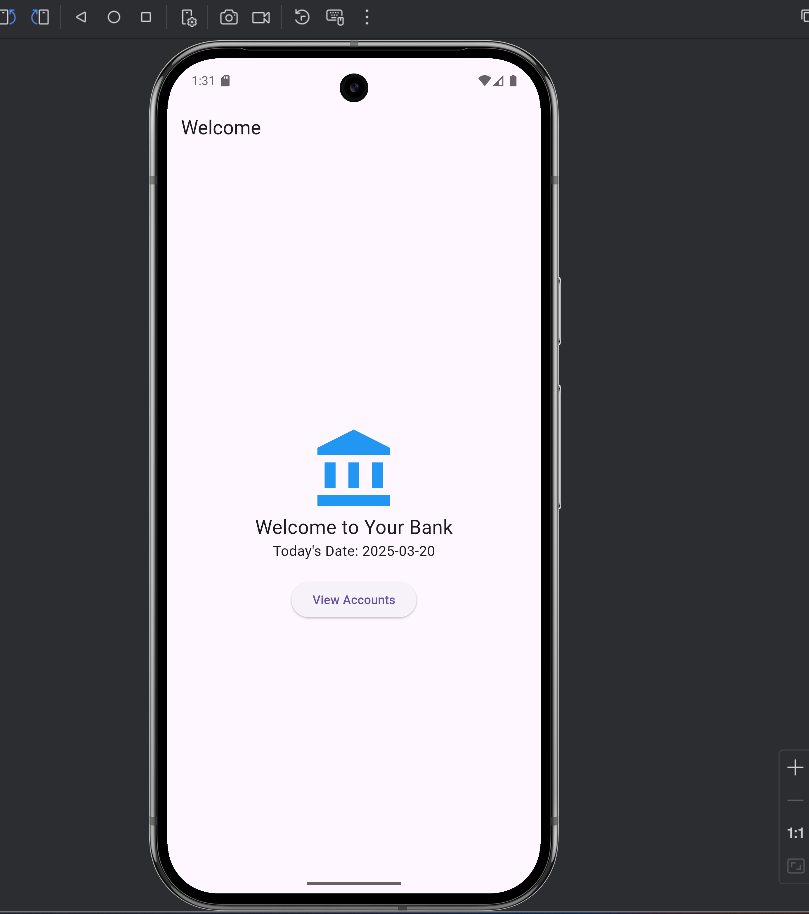

# test3

This Flutter-based mobile banking app allows users to view account details and transactions. 
It has three main screens: 
1.The Welcome Screen
2.Account List Screen
3.Transaction Details Screen.

The app loads data from a JSON file that contains account and transaction information.

1. The Welcome Screen displays the bank's logo, a welcome message, and today's date. 
It allows users to navigate to the Account List. 

2. The Account List Screen shows a list of accounts with details like account holder name, account ID,
and balance, and lets users select an account to view its transactions.

3. The Transaction Details Screen displays the transactions of the selected account, including 
transaction ID, date, amount, and type (Deposit/Withdrawal). Navigation is restricted: users can 
only navigate back from the Transaction Details to the Account List, and from the Account List to 
the Welcome Screen.

**Key Files & Modifications**

The main.dart file serves as the entry point for the Mobile Banking App. It 
initializes the Flutter application, sets up the primary UI structure, and loads account data from
a local JSON file.
Key Functionalities:
App Initialization: The BankingApp class is defined as a StatelessWidget and sets up the 
MaterialApp with a title, theme, and the initial screen (AccountListScreen).

- Account List Management: The AccountListScreen is a StatefulWidget that:
Loads accounts.json from the assets folder using rootBundle.loadString().
Parses the JSON data and stores it in a List of accounts.
Displays the list of accounts in a ListView.builder.
Provides a button to navigate to the transaction details screen for a selected account.

- Transaction Details Management: The TransactionDetailsScreen:
Loads transactions.json from the assets folder.
Filters and displays transactions specific to the selected account.
Uses color indicators to differentiate deposits (green) and withdrawals (red).

**Short Introduction of the running of code**
The app is built using Flutter, and the account and transaction data is stored in a accounts.json 
file. The file structure includes models for accounts and transactions, along with screen files for
each UI component.

To run the app, clone the repository, install dependencies with flutter pub get, and use flutter run
to launch the app.

In this project we have add a  dependency in pubspec.yaml
- assets/accounts.json and assets/transaction.json and 
- install pub get to install the dependency in our flutter project.

- We have make a assets directory in our flutter project and inside that we have created a accounts.json directory 
- for the transcation, and account holder details.

- [Lab: Write your first Flutter app](https://docs.flutter.dev/get-started/codelab)
- [Cookbook: Useful Flutter samples](https://docs.flutter.dev/cookbook)

For help getting started with Flutter development, view the
[online documentation](https://docs.flutter.dev/), which offers tutorials,
samples, guidance on mobile development, and a full API reference.
